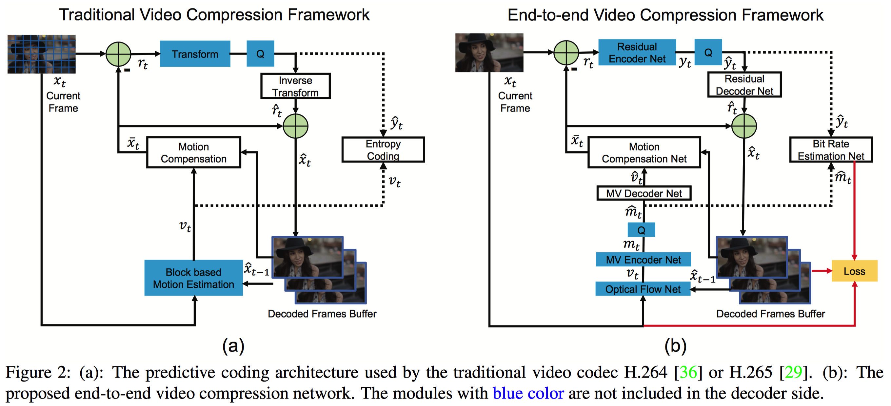
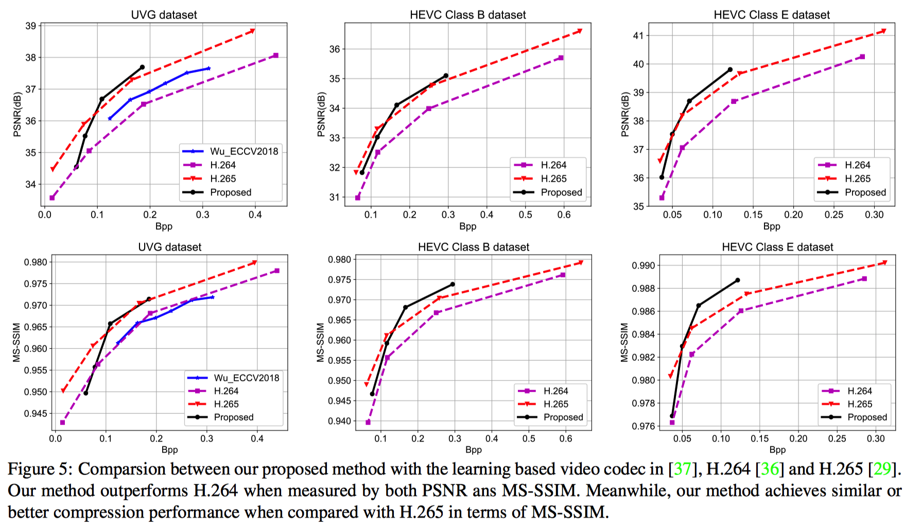

# DVC: An End-to-end Deep Video Compression Framework
This repo holds the code for the paper:

DVC: An End-to-end Deep Video Compression Framework, Guo Lu, Wanli Ouyang, Dong Xu, Xiaoyun Zhang, Chunlei Cai, Zhiyong Gao, CVPR 2019 (**Oral**). [[arXiv]](https://arxiv.org/abs/1812.00101)





## Update
2020-04-07: I upload the 4 pre-train models with different lambda values and you can use different lambda for rate control.

## Test

#### Pretrain models

We provide the test code of our DVC framework. In our implementation, we use the learning based image compression algorithm ([Ballé et al](https://arxiv.org/abs/1802.01436)) as the intra compression. 
Specifically, for the video codec model with `lambda=k`, the image codec model with `lambda=4k` is used as the intra frames.
For the image codec, please refer to [GoogleCompression](https://github.com/tensorflow/compression). 
And the pre-train models of our DVC are located in `TestDemo/VideoCodec/model`.

<!-- Both the pre-train models of video codecs and image codecs in our framework are available at [Dropbox](https://www.dropbox.com/s/9gc18ylms0rf9jl/PretrainModel.zip?dl=0).  -->


#### Entropy Coding

Currently, we do not provide the entropy coding module. The generated features from image/video codecs are saved to `.pkl` files. We give the estimated Bpp for these features. It is straightforward to compress these features by using traditional entropy coding tools, such as CABAC.

<!-- #### Image Compression

```
cd ./TestDemo/ImageCodec
```

Image Encoding,

```
python Encoder.py --EncoderModel /path/to/encoder/model/.pb --input_frame /path/to/image/x.png  --output /output/feature/folder/
```

Image Decoding,

```
python Decoder.py --DecoderModel /path/to/decoder/model/.pb   --loadpath  /load/feature/folder/
``` -->

#### Video Compression

```
cd ./TestDemo/VideoCodec
```

Video Encoding,
```
python  Encoder.py --EncoderModel /path/to/encoder/model/frozen_model_E.pb  --input_frame /path/to/currentframe/im002.png --refer_frame  /path/to/previousframe/im001.png  	--output /output/feature/folder/
```
Video Decoding,

```
python Decoder.py --DecoderModel /path/to/decoder/model/frozen_model_D.pb  --refer_frame /path/to/previous/im001.png --loadpath  /path/to/feature/folder/
```


### Experimental Results

Evaluation results on the UVG dataset and HEVC Class B (1080p) and Class E (720p). Please refer to our paper for more experimental results.

We also provide the scrips for generating all the RD curves of our paper in folder `RDCurve`.


### Citation
If you find our paper useful, please cite:
```
@article{lu2018dvc,
  title={DVC: An End-to-end Deep Video Compression Framework},
  author={Lu, Guo and Ouyang, Wanli and Xu, Dong and Zhang, Xiaoyun and Cai, Chunlei and Gao, Zhiyong},
  journal={arXiv preprint arXiv:1812.00101},
  year={2018}
}
```


### Contact
You can contact Guo Lu by sending mail to luguo2014@sjtu.edu.cn
